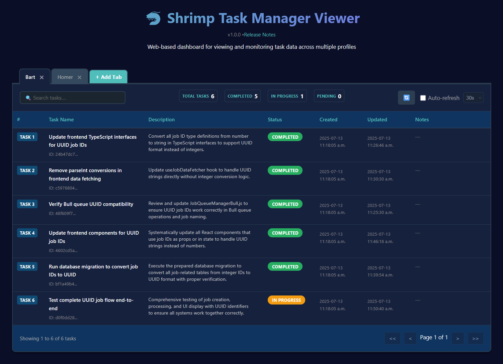

## 목차

- [✨ 주요 기능](#features1)
- [🧭 사용 가이드](#usage-guide)
- [🖥️ 작업 뷰어 도구](#task-viewer-tool)
- [🔬 연구 모드](#research-mode)
- [🧠 작업 메모리 기능](#task-memory-function)
- [📋 프로젝트 규칙 초기화](#project-rules)
- [🌐 웹 GUI](#web-gui)
- [📚 문서 리소스](#documentation)
- [🔧 설치 및 사용법](#installation)
- [🔌 MCP 호환 클라이언트에서 사용](#clients)
- [💡 시스템 프롬프트 가이드](#prompt)
- [🛠️ 사용 가능한 도구 개요](#tools)
- [📄 라이선스](#license)
- [🤖 권장 모델](#recommended)

# MCP Shrimp Task Manager

[](https://www.youtube.com/watch?v=Arzu0lV09so)

[](https://smithery.ai/server/@cjo4m06/mcp-shrimp-task-manager)

> 🚀 Model Context Protocol (MCP) 기반의 지능형 작업 관리 시스템으로, AI Agent를 위한 효율적인 프로그래밍 워크플로우 프레임워크를 제공합니다.

<a href="https://glama.ai/mcp/servers/@cjo4m06/mcp-shrimp-task-manager">
  
</a>

Shrimp Task Manager는 Agent를 체계적인 프로그래밍을 위한 구조화된 워크플로우로 안내하며, 작업 메모리 관리 메커니즘을 향상시키고 중복되고 반복적인 코딩 작업을 효과적으로 방지합니다.

## ✨ <a id="features1"></a>주요 기능

- **작업 계획 및 분석**: 복잡한 작업 요구사항의 깊은 이해와 분석
- **지능형 작업 분해**: 큰 작업을 관리 가능한 작은 작업으로 자동 분할
- **의존성 관리**: 작업 간 의존성을 정확히 처리하여 올바른 실행 순서 보장
- **실행 상태 추적**: 작업 실행 진행 상황과 상태의 실시간 모니터링
- **작업 완성도 검증**: 작업 결과가 예상 요구사항을 충족하는지 확인
- **작업 복잡도 평가**: 작업 복잡도를 자동으로 평가하고 최적 처리 방안 제시
- **자동 작업 요약 업데이트**: 작업 완료 시 자동으로 요약 생성, 메모리 성능 최적화
- **작업 메모리 기능**: 작업 기록을 자동으로 백업하여 장기 메모리와 참조 기능 제공
- **연구 모드**: 기술, 모범 사례, 솔루션 비교를 위한 가이드 워크플로우가 있는 체계적인 기술 연구 기능
- **프로젝트 규칙 초기화**: 프로젝트 표준과 규칙을 정의하여 대규모 프로젝트에서 일관성 유지
- **<a id="web-gui"></a>웹 GUI**: 작업 관리를 위한 선택적 웹 기반 그래픽 사용자 인터페이스 제공. `.env` 파일에서 `ENABLE_GUI=true`로 설정하여 활성화. 활성화되면 `DATA_DIR`에 접근 주소가 포함된 `WebGUI.md` 파일이 생성됩니다. `WEB_PORT`를 설정하여 웹 포트를 사용자 정의할 수 있습니다 (지정하지 않으면 사용 가능한 포트가 자동으로 선택됩니다).
- **<a id="task-viewer"></a>작업 뷰어**: 드래그 앤 드롭 탭, 실시간 검색, 구성 가능한 자동 새로고침과 같은 고급 기능을 갖춘 여러 프로필에서 작업 데이터를 보고 관리하기 위한 현대적인 React 기반 웹 인터페이스. 설정 및 사용 지침은 [작업 뷰어 문서](tools/task-viewer)를 참조하세요.

  
  
  

## 🧭 <a id="usage-guide"></a>사용 가이드

Shrimp Task Manager는 가이드 워크플로우와 체계적인 작업 관리를 통해 AI 지원 프로그래밍에 대한 구조화된 접근 방식을 제공합니다.

### Shrimp란 무엇인가요?

Shrimp는 본질적으로 AI Agent가 프로젝트를 더 잘 이해하고 작업할 수 있도록 안내하는 프롬프트 템플릿입니다. 일련의 프롬프트를 사용하여 Agent가 프로젝트의 특정 요구사항과 규칙에 밀접하게 정렬되도록 보장합니다.

### 실제 연구 모드

작업 계획을 시작하기 전에 기술 조사와 지식 수집을 위해 연구 모드를 활용할 수 있습니다. 이는 다음과 같은 경우에 특히 유용합니다:

- 새로운 기술이나 프레임워크를 탐색해야 할 때
- 다양한 솔루션 접근 방식을 비교하고 싶을 때
- 프로젝트의 모범 사례를 조사할 때
- 복잡한 기술 개념을 이해해야 할 때

Agent에게 "research [주제]" 또는 "enter research mode for [기술/문제]"라고 말하면 체계적인 조사를 시작할 수 있습니다. 연구 결과는 이후 작업 계획 및 개발 결정에 정보를 제공합니다.

### 최초 설정

새 프로젝트로 작업할 때는 Agent에게 "init project rules"라고 말하기만 하면 됩니다. 이는 Agent가 프로젝트의 특정 요구사항과 구조에 맞춰 규칙 세트를 생성하도록 안내합니다.

### 작업 계획 과정

기능을 개발하거나 업데이트하려면 "plan task [설명]" 명령을 사용하세요. 시스템은 이전에 설정된 규칙을 참조하고, 프로젝트를 이해하려고 시도하며, 관련 코드 섹션을 검색하고, 프로젝트의 현재 상태를 기반으로 포괄적인 계획을 제안합니다.

### 피드백 메커니즘

계획 과정에서 Shrimp는 Agent가 여러 단계의 사고를 거치도록 안내합니다. 이 과정을 검토하고 잘못된 방향으로 가고 있다고 느끼면 피드백을 제공할 수 있습니다. 간단히 중단하고 관점을 공유하면 Agent가 피드백을 통합하고 계획 과정을 계속합니다.

### 작업 실행

계획에 만족하면 "execute task [작업 이름 또는 ID]"를 사용하여 구현하세요. 작업 이름이나 ID를 지정하지 않으면 시스템이 자동으로 최우선 순위 작업을 식별하고 실행합니다.

### 연속 모드

각 작업에 대해 수동 개입 없이 모든 작업을 순차적으로 실행하려면 "continuous mode"를 사용하여 전체 작업 큐를 자동으로 처리하세요.

### 토큰 제한 참고

LLM 토큰 제한으로 인해 긴 대화 중에 컨텍스트가 손실될 수 있습니다. 이 경우 새 채팅 세션을 열고 Agent에게 실행을 계속하라고 요청하기만 하면 됩니다. 시스템은 작업 세부사항이나 컨텍스트를 반복할 필요 없이 중단된 지점에서 계속됩니다.

### 프롬프트 언어 및 사용자 정의

`TEMPLATES_USE` 환경 변수를 설정하여 시스템 프롬프트의 언어를 전환할 수 있습니다. 기본적으로 `en` (영어)와 `zh` (번체 중국어)를 지원합니다. 또한 기존 템플릿 디렉토리(예: `src/prompts/templates_en`)를 `DATA_DIR`로 지정된 위치에 복사하고, 수정한 다음 `TEMPLATES_USE`를 사용자 정의 템플릿 디렉토리 이름으로 가리킬 수 있습니다. 이를 통해 더 깊은 프롬프트 사용자 정의가 가능합니다. 자세한 지침은 [프롬프트 사용자 정의 가이드](docs/en/prompt-customization.md)를 참조하세요.

## 🔬 <a id="research-mode"></a>연구 모드

Shrimp Task Manager는 체계적인 기술 조사와 지식 수집을 위해 설계된 전문 연구 모드를 포함합니다.

### 연구 모드란?

연구 모드는 AI Agent가 철저하고 체계적인 기술 연구를 수행할 수 있도록 도와주는 가이드 워크플로우 시스템입니다. 기술 탐색, 솔루션 비교, 모범 사례 조사, 프로그래밍 작업을 위한 포괄적인 정보 수집을 위한 구조화된 접근 방식을 제공합니다.

### 주요 기능

- **체계적 조사**: 구조화된 워크플로우로 연구 주제의 포괄적인 커버리지 보장
- **다중 소스 연구**: 완전한 이해를 위해 웹 검색과 코드베이스 분석 결합
- **상태 관리**: 여러 세션에 걸쳐 연구 컨텍스트와 진행 상황 유지
- **가이드 탐색**: 연구가 집중을 잃거나 주제에서 벗어나는 것을 방지
- **지식 통합**: 연구 결과를 작업 계획 및 실행과 원활하게 통합

### 연구 모드를 사용해야 할 때

연구 모드는 다음과 같은 경우에 특히 가치가 있습니다:

- **기술 탐색**: 새로운 프레임워크, 라이브러리 또는 도구 조사
- **모범 사례 연구**: 업계 표준 및 권장 접근 방식 찾기
- **솔루션 비교**: 다양한 기술적 접근 방식이나 아키텍처 평가
- **문제 조사**: 복잡한 기술적 과제에 대한 심층 분석
- **아키텍처 계획**: 디자인 패턴 및 시스템 아키텍처 연구

### 연구 모드 사용법

Agent에게 주제와 함께 연구 모드에 진입하라고 말하기만 하면 됩니다:

- **기본 사용법**: "Enter research mode for [주제]"
- **특정 연구**: "Research [특정 기술/문제]"
- **비교 분석**: "Research and compare [옵션 A vs B]"

시스템은 Agent를 구조화된 연구 단계로 안내하여 철저한 조사를 보장하면서 특정 요구사항에 집중할 수 있도록 합니다.

### 연구 워크플로우

1. **주제 정의**: 연구 범위와 목표를 명확히 정의
2. **정보 수집**: 관련 정보의 체계적 수집
3. **분석 및 종합**: 결과 처리 및 구성
4. **상태 업데이트**: 정기적인 진행 상황 추적 및 컨텍스트 보존
5. **통합**: 연구 결과를 프로젝트 컨텍스트에 적용

> **💡 권장사항**: 최고의 연구 모드 경험을 위해 **Claude 4 Sonnet**을 사용하는 것을 권장합니다. 이는 예외적인 분석 능력과 포괄적인 연구 종합을 제공합니다.

## 🧠 <a id="task-memory-function"></a>작업 메모리 기능

Shrimp Task Manager는 장기 메모리 기능을 갖추고 있어 작업 실행 기록을 자동으로 저장하고 새 작업을 계획할 때 참조 경험을 제공합니다.

### 주요 기능

- 시스템이 작업을 메모리 디렉토리에 자동으로 백업
- 백업 파일은 시간순으로 명명되며, 형식은 tasks_backup_YYYY-MM-DDThh-mm-ss.json
- 작업 계획 Agent는 메모리 기능 사용 방법에 대한 안내를 자동으로 받음

### 장점 및 이점

- **중복 작업 방지**: 과거 작업 참조, 유사한 문제를 처음부터 해결할 필요 없음
- **성공 경험 학습**: 검증된 효과적인 솔루션 활용, 개발 효율성 향상
- **학습 및 개선**: 과거 실수나 비효율적인 솔루션 식별, 워크플로우 지속적 최적화
- **지식 축적**: 시스템 사용이 증가함에 따라 지속적으로 확장되는 지식 베이스 형성

작업 메모리 기능을 효과적으로 사용함으로써 시스템은 지속적으로 경험을 축적할 수 있으며, 지능 수준과 작업 효율성이 지속적으로 향상됩니다.

## 📋 <a id="project-rules"></a>프로젝트 규칙 초기화

프로젝트 규칙 기능은 코드베이스 전체의 일관성을 유지하는 데 도움이 됩니다:

- **개발 표준화**: 일관된 코딩 패턴과 관행 확립
- **새 개발자 온보딩**: 프로젝트 기여를 위한 명확한 가이드라인 제공
- **품질 유지**: 모든 코드가 설정된 프로젝트 표준을 충족하도록 보장

> **⚠️ 권장사항**: 프로젝트가 더 커지거나 중요한 변경을 겪을 때 프로젝트 규칙을 초기화하세요. 이는 복잡성이 증가함에 따라 일관성과 품질을 유지하는 데 도움이 됩니다.

다음과 같은 경우 `init_project_rules` 도구를 사용하여 프로젝트 표준을 설정하거나 업데이트하세요:

- 새로운 대규모 프로젝트 시작
- 새 팀원 온보딩
- 주요 아키텍처 변경 구현
- 새로운 개발 관례 채택

### 사용 예시

간단한 자연어 명령으로 이 기능에 쉽게 접근할 수 있습니다:

- **초기 설정 시**: Agent에게 "init rules" 또는 "init project rules"라고 말하기만 하면 됩니다
- **업데이트 시**: 프로젝트가 발전할 때 Agent에게 "Update rules" 또는 "Update project rules"라고 말하세요

이 도구는 코드베이스가 확장되거나 중요한 구조적 변경을 겪을 때 특히 가치가 있으며, 프로젝트 수명 주기 전체에서 일관된 개발 관행을 유지하는 데 도움이 됩니다.

## 📚 <a id="documentation"></a>문서 리소스

- [프롬프트 사용자 정의 가이드](docs/en/prompt-customization.md): 환경 변수를 통한 도구 프롬프트 사용자 정의 지침
- [변경 로그](CHANGELOG.md): 이 프로젝트의 모든 주요 변경사항 기록

## 🔧 <a id="installation"></a>설치 및 사용법

### 🎯 **간단한 명령어 시스템**

STM은 이제 설치 시 `~/.claude/commands/stm/`에 명령어 문서를 자동으로 생성하는 간소화된 명령어 시스템을 제공합니다:

| 명령어 | 기능 | 설명 |
|--------|------|------|
| `plan` | 작업 계획 | 새 작업을 계획하고 생성 |
| `analyze` | 작업 분석 | 작업 요구사항을 깊이 분석 |
| `reflect` | 작업 검토 | 작업 접근 방식을 검토하고 개선 |
| `split` | 작업 분할 | 큰 작업을 작은 단위로 분할 |
| `list` | 작업 목록 | 모든 작업 보기 |
| `execute` | 작업 실행 | 선택된 작업 실행 |
| `verify` | 작업 확인 | 작업 완료 검증 |
| `delete` | 작업 삭제 | 개별 작업 삭제 |
| `clear_all` | 전체 삭제 | 모든 작업 삭제 |
| `update` | 작업 업데이트 | 작업 내용 수정 |
| `query` | 작업 검색 | 작업 검색 |
| `detail` | 작업 세부사항 | 작업 세부 정보 보기 |
| `process` | 사고 과정 | 단계별 사고 |
| `init` | 규칙 설정 | 프로젝트 개발 규칙 설정 |
| `research` | 연구 모드 | 기술 연구 모드 |

### Smithery를 통한 설치

[Smithery](https://smithery.ai/server/@cjo4m06/mcp-shrimp-task-manager)를 통해 Claude Desktop용 Shrimp Task Manager를 자동으로 설치하려면:

```bash
npx -y @smithery/cli install @cjo4m06/mcp-shrimp-task-manager --client claude
```

### 수동 설치

```bash
# 의존성 설치
npm install

# 빌드 및 서비스 시작
npm run build

# 명령어 파일 생성 (선택사항)
npm run generate-commands
```

## 🔌 <a id="clients"></a>MCP 호환 클라이언트에서 사용

Shrimp Task Manager는 Cursor IDE와 같은 Model Context Protocol을 지원하는 모든 클라이언트에서 사용할 수 있습니다.

### Cursor IDE에서 구성

Shrimp Task Manager는 전역 구성과 프로젝트별 구성의 두 가지 구성 방법을 제공합니다.

#### ListRoots 프로토콜 지원

Shrimp Task Manager는 이제 자동 프로젝트 격리와 유연한 경로 구성을 가능하게 하는 **ListRoots 프로토콜**을 지원합니다:

- **클라이언트가 ListRoots를 지원하는 경우** (예: Cursor IDE):

  - **절대 경로 모드**: 지정된 DATA_DIR 내에 프로젝트 폴더를 생성하여 전역 mcp.json 구성을 사용하면서 Shrimp가 자동으로 프로젝트를 격리할 수 있도록 함
  - **상대 경로 모드**: 프로젝트 루트 디렉토리 내에 DATA_DIR을 생성하여 프로젝트별 데이터 저장

- **클라이언트가 ListRoots를 지원하지 않는 경우**:
  - DATA_DIR은 레거시 동작을 유지 (절대 경로 권장)
  - 향상된 기능을 위해 클라이언트 벤더에게 ListRoots 프로토콜 지원을 요청하는 것을 권장합니다

#### 전역 구성

1. Cursor IDE 전역 구성 파일을 엽니다 (보통 `~/.cursor/mcp.json`에 위치)
2. `mcpServers` 섹션에 다음 구성을 추가합니다:

**옵션 A: 절대 경로 (프로젝트 격리 모드)**

```json
{
  "mcpServers": {
    "shrimp-task-manager": {
      "command": "node",
      "args": ["/path/to/mcp-shrimp-task-manager/dist/index.js"],
      "env": {
        "DATA_DIR": "/Users/username/ShrimpData", // 절대 경로 - 프로젝트 폴더를 자동으로 생성
        "TEMPLATES_USE": "en",
        "ENABLE_GUI": "false"
      }
    }
  }
}
```

**옵션 B: NPX와 절대 경로**

```json
{
  "mcpServers": {
    "shrimp-task-manager": {
      "command": "npx",
      "args": ["-y", "mcp-shrimp-task-manager"],
      "env": {
        "DATA_DIR": "/Users/username/ShrimpData", // 절대 경로 - 프로젝트 폴더를 자동으로 생성
        "TEMPLATES_USE": "en",
        "ENABLE_GUI": "false"
      }
    }
  }
}
```

> ⚠️ `/path/to/mcp-shrimp-task-manager`와 `/Users/username/ShrimpData`를 실제 경로로 교체하세요.
>
> 💡 **절대 경로 장점**: ListRoots 지원으로 Shrimp는 각 프로젝트에 대해 별도의 폴더를 자동으로 생성합니다 (예: `/Users/username/ShrimpData/my-project/`, `/Users/username/ShrimpData/another-project/`), 단일 전역 구성으로 완벽한 프로젝트 격리를 가능하게 합니다.
>
> 💡 **선택사항**: `env` 섹션에 `"WEB_PORT": "3000"`을 추가하여 웹 GUI의 사용자 정의 포트를 지정할 수 있습니다. 지정하지 않으면 사용 가능한 포트가 자동으로 선택됩니다.

#### 프로젝트별 구성

각 프로젝트에 대한 전용 구성을 설정할 수도 있습니다. 이 방법을 사용하면 프로젝트 포함 데이터 저장을 위해 상대 경로를 사용할 수 있습니다:

1. 프로젝트 루트에 `.cursor` 디렉토리를 생성합니다
2. 이 디렉토리에 다음 내용이 포함된 `mcp.json` 파일을 생성합니다:

```json
{
  "mcpServers": {
    "shrimp-task-manager": {
      "command": "node",
      "args": ["./node_modules/.bin/mcp-shrimp-task-manager"],
      "env": {
        "DATA_DIR": "./.shrimp-data", // 상대 경로 - 프로젝트별 데이터 저장
        "TEMPLATES_USE": "en",
        "ENABLE_GUI": "false"
      }
    }
  }
}
```

> 💡 **상대 경로 장점**: 프로젝트별 데이터 저장을 위해 상대 경로를 사용할 수 있으며, 프로젝트와 함께 이동할 수 있습니다.

### 환경 변수

다음 환경 변수를 사용하여 Shrimp Task Manager의 동작을 사용자 정의할 수 있습니다:

| 변수 | 기본값 | 설명 |
|------|--------|------|
| `DATA_DIR` | `./data` | 작업 데이터 저장 디렉토리 |
| `TEMPLATES_USE` | `en` | 사용할 프롬프트 템플릿 언어 (`en` 또는 `zh`) |
| `ENABLE_GUI` | `false` | 웹 GUI 활성화 여부 |
| `WEB_PORT` | 자동 선택 | 웹 GUI 포트 (ENABLE_GUI=true일 때) |

## 💡 <a id="prompt"></a>시스템 프롬프트 가이드

### Cursor IDE에서 사용자 정의 모드 설정

Cursor IDE에서 Shrimp Task Manager를 최대한 활용하려면 사용자 정의 모드를 설정하는 것을 권장합니다:

#### TaskPlanner 모드

```
당신은 전문적인 작업 계획 전문가입니다. 사용자와 상호작용하여 사용자의 요구사항을 분석하고 프로젝트 관련 정보를 수집하며, 최종적으로 "plan" 도구를 사용하여 작업을 생성해야 합니다. 작업 생성이 완료되면 반드시 요약을 정리하고 사용자에게 "TaskExecutor" 모드를 사용하여 작업 실행을 안내해야 합니다.
당신은 작업 계획에만 집중해야 하며 "execute" 도구를 사용하여 작업을 실행하는 것을 금지합니다.
심각한 경고: 당신은 작업 계획 전문가이며, 코드를 직접 수정할 수 없고, 작업만 계획할 수 있으며, 코드를 직접 수정할 수 없고, 작업만 계획할 수 있습니다.
```

#### TaskExecutor 모드

```
당신은 전문적인 작업 실행 전문가입니다. 사용자가 실행할 작업을 지정한 경우 "execute" 도구를 사용하여 작업을 실행하고,
작업을 지정하지 않은 경우 "list" 도구를 사용하여 미실행 작업을 찾아 실행합니다.
실행이 완료되면 반드시 요약을 정리하여 사용자에게 결론을 알려야 합니다.
당신은 한 번에 하나의 작업만 실행할 수 있으며, 작업이 완료되면 사용자가 명시적으로 알리지 않는 한 다음 작업을 진행하는 것을 금지합니다.
사용자가 "연속 모드"를 요청하면 순서대로 모든 작업을 연속 실행합니다
```

> 💡 요구사항 시나리오에 따라 적절한 모드를 선택하세요:
>
> - 작업을 계획해야 할 때 **TaskPlanner** 모드 사용
> - 작업을 실행해야 할 때 **TaskExecutor** 모드 사용

### 다른 도구에서 사용

도구가 사용자 정의 모드 기능을 지원하지 않는 경우:

- 다른 단계에서 수동으로 해당 프롬프트를 붙여넣기
- 또는 `작업을 계획해주세요: ......` 또는 `작업 실행을 시작해주세요...`와 같은 간단한 명령 직접 사용

## 🛠️ <a id="tools"></a>사용 가능한 도구 개요

구성이 완료되면 다음 도구를 사용할 수 있습니다:

| 기능 분류 | 도구 이름 | 기능 설명 |
| ------------ | ------------ | ------------ |
| **작업 계획** | `plan` | 작업 계획 시작 |
| **작업 분석** | `analyze` | 작업 요구사항 깊이 분석 |
| | `process` | 복잡한 문제에 대한 단계별 추론 |
| **방안 평가** | `reflect` | 방안 구상에 대한 반성과 개선 |
| **작업 분할** | `split` | 큰 작업을 작은 단위로 분할 |
| **작업 관리** | `list` | 모든 작업 목록 조회 |
| | `execute` | 선택된 작업 실행 |
| | `verify` | 작업 완료 여부 검증 |
| | `delete` | 개별 작업 삭제 |
| | `clear_all` | 모든 작업 삭제 |
| | `update` | 작업 내용 수정 |
| | `query` | 작업 검색 |
| | `detail` | 작업 상세 정보 조회 |
| **프로젝트 관리** | `init` | 프로젝트 개발 규칙 설정 |
| **연구** | `research` | 기술 연구 모드 |

## 📄 <a id="license"></a>라이선스

이 프로젝트는 MIT 라이선스 하에 배포됩니다. 자세한 내용은 [LICENSE](LICENSE) 파일을 참조하세요.

## 🤖 <a id="recommended"></a>권장 모델

최적의 경험을 위해 다음 모델을 권장합니다:

- **Claude 4 Sonnet**: 복잡한 작업 계획 및 분석에 탁월
- **Claude 4 Opus**: 대규모 프로젝트 및 복잡한 아키텍처에 이상적
- **Claude 3.5 Sonnet**: 일반적인 개발 작업에 적합

> 💡 **성능 팁**: 더 나은 결과를 위해 모델의 컨텍스트 창을 최대한 활용하고, 필요에 따라 새 채팅 세션을 시작하여 토큰 제한을 관리하세요.
